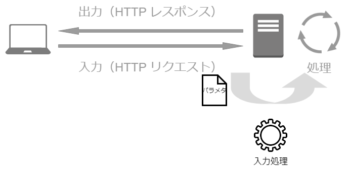
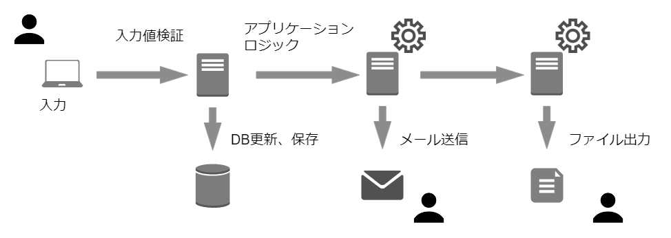
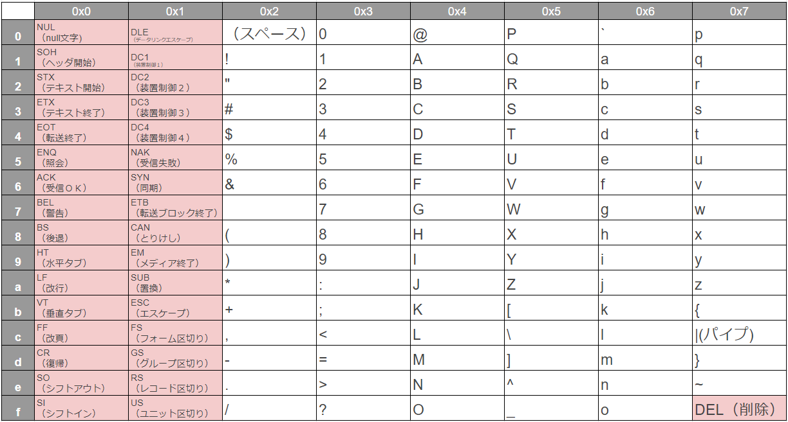

## Webアプリケーションの機能別に見るセキュリティバグ
~入力処理とセキュリティ~

--

### 自己紹介

- 名前：今村昌平
- 職業：システムエンジニア(3年目)
- 脆弱性：花粉、睡眠不足

--

### 本ドキュメントについて

- Weeyble 勉強会のための資料です
- 権利関係で問題がありましたら、ご連絡ください
- reveal.js で作成しています
- スライドは[こちら](https://shoheiimamura.github.io/secure_web_apps_4.2/#/)からアクセスできます。

--

### 目次

- [入力処理の概要](#入力処理の概要)
  - [文字エンコーディングの妥当性検証](#文字エンコーディングの妥当性検証)
  - [文字エンコーディングの変換](#文字エンコーディングの変換)
  - [入力値の検証](#入力値の検証)
- Appendix
  - [バイナリセーフとヌルバイト攻撃](#appendix-1)
  - [正規表現による入力値検証](#appendix-2)
  - [入力値検証とフレームワーク](#appendix-3)
  - [サンプルアプリケーション](#appendix-4)

---

### 入力処理の概要

--

### 入力値のチェックで出来ること

- 根本的な脆弱性対策はできない
- 根本的な対策が漏れていた場合に、実害を防止・軽減できる

--

### Web アプリケーションの入力値

Webアプリケーションの入力値  
（＝ HTTP リクエストパラメータ）
  - GET パラメータ
  - POST パラメータ
  - クッキー（等々）

--

### 「入力処理」とは

- 入力値を受け付ける際に行う処理
- 「入力-処理-出力」のデータ準備段階



--

### 「入力処理」でやること

- 文字エンコーディングの妥当性検証
- 文字エンコーディングの変換
- 入力値の妥当性検証

---

### 文字エンコーディングの妥当性検証

- 文字コードを利用した攻撃を防ぐことが目的

--

#### 文字コードとは

- コンピュータ内で"文字"を扱うための"符号"
- １つの文字に対して、１つの符号が割当てられる

文字コード対応表(ASCII)

| 文字 | 文字コード(2進数) | 16進数 |
|------|-------------------|--------|
| A    | 01000001          | 41     |
| !    | 00100001          | 21     |

--

#### 文字コードとは（２）

- 歴史的経緯により、対応表は複数存在する
  - ASCII
  - SHIFT-JIS
  - （等々）

文字コード比較表

| 文字 | ASCII | SHIFT-JIS | Unicode |
|------|-------|-----------|---------|
| A    | 41    | 41        | U+0041  |
| あ   | -     | 82a0      | U+3042  |

--

#### 文字エンコーディングとは

- （対応表を用いて）文字を符号化すること
- 対応表は複数存在する
  - UTF-8
  - SHIFT-JIS

--

### 文字エンコーディングの検証（再掲）

- 文字コードを利用した攻撃を防ぐことが目的
- 検証には [mb_check_encoding 関数](https://www.php.net/manual/ja/function.mb-check-encoding.php)を利用する
    - $var ：チェック対象の文字列
    - $encoding ：文字エンコーディング

```php
mb_check_encoding (string $var, string $encoding) : bool
```

--

### 文字エンコーディングの検証例

- パラメータ値（'name'）が SHIFT-JIS かチェック

```php

$name = isset($_GET['name']) ? $_GET['name'] : '';
// 文字エンコーディング（SHIFT-JIS）のチェック
if(! mb_check_encoding($name, 'Shift_JIS')) {
    die('文字エンコーディングが不正です');
}

```

--

### 文字エンコーディングの検証例（2）

- パラメータが Shift-JIS
    - [http://example.jp/42/42-001.php?name=%8ER%93c](https://example.jp/42/42-001.php?name=%8ER%93c)
- パラメータが Shift-JIS 以外
    - [http://example.jp/42/42-001.php?name=%82%21](https://example.jp/42/42-001.php?name=%82%21)

---

### 文字エンコーディングの変換

- 2 通りの方法が存在する
  - 設定ファイル（php.ini）を利用
  - 変換ロジック[mb_convert_encoding](https://www.php.net/manual/ja/function.mb-convert-encoding.php)を利用

--

### 文字エンコーディングの変換例

- SHIFT-JIS から UTF-8 へ文字エンコーディングを変換する例

```php

$name = mb_convert_encoding($name, 'UTF-8', 'Shift_JIS');

```

---

### 入力値の検証

- 入力値の検証とは
  - 仕様に合致しない入力値を弾くこと
- メリット
  - 入力値の間違いを早期に発見できる
  - 間違った処理を継続することによって発生するデータの不整合を防げる

--

### 入力値検証がなかったら

- 仕様に合致しないデータ入力は、必ずどこかでエラーを引き起こす
- できるだけ早期に発見するほうが良い



--

### セキュリティの役に立つ場合

- 本来実施すべき脆弱性対策が漏れていた場合に実害を抑える事がある
  - SQL インジェクション未対策時
  - PHP バイナリセーフ関数を利用時
  - 表示処理に文字エンコーディング忘れ時

--

### 入力値検証の対象とするパラメータ

- すべてのパラメータを検証対象とする
  - クッキーの値も検証対象
  - HTTP ヘッダも検証対象

--

### 要件に応じた入力値検証

- アプリケーション仕様に応じて、入力値のチェックを行う
  - 制御文字チェック
  - 文字数チェック
  - 最大最小値チェック
  - (等々...)

--

### 制御文字のチェック

- 制御文字とは、通常表示されない文字
  - 改行、タブ、等々



--

### 制御文字のチェック(２)

- input 要素（text, password）には、通常は制御文字を入力できない
- textarea 要素は、改行、タブの入力を許可するかどうかを決める必要がある

--

### 文字数のチェック

- 脆弱性を狙った攻撃は、長い文字列を要する場合が多い
- すべてのパラメータについて最大文字数を定義すべき
  - 物理的な上限値が無い場合も含む

--

### 数値の最小値・最大値チェック

- 入力数値に応じて、メモリを確保する場合等は、脆弱性となりうる

--

### その他の注意点

- 入力項目が指定されていない場合
- 配列形式で入力される場合
  - [filter_input()](https://www.php.net/manual/ja/function.filter-input.php) を利用

---

### appendix

1. バイナリセーフとヌルバイト攻撃
2. 正規表現による入力値検証
3. 入力値検証とフレームワーク
4. サンプルアプリケーション

---

#### APPENDIX (1)

バイナリセーフとヌルバイト攻撃

--

#### バイナリセーフとは

- どんなバイト列（ヌルバイト含む）であっても正しく扱えること
- PHP には、ヌルバイト以降を切り詰めて扱う関数が存在する
  - [ereg()](https://www.php.net/manual/ja/function.ereg.php)
  - [split()](https://www.php.net/manual/ja/function.split.php)
  - [fopen()](https://www.php.net/manual/ja/function.fopen.php)

--

#### ヌルバイトとは

- ヌルバイトとは、値ゼロのバイトのこと
- C 言語では、文字列の終端として扱う
  - 以降の文字列は切り詰める

--

#### ヌルバイト以降切り詰めの例

| 文字     | 1  | %00 | <  | s  | c  | r  |
|----------|----|-----|----|----|----|----|
| 文字の値 | 31 | 00  | 3c | 73 | 63 | 72 |

--

#### ヌルバイト攻撃に脆弱なサンプル

- パラメータが数字のみであることを検証
  - ereg( ) 関数を利用

```php
<body>
<?php
    $p = $_GET['p'];
    if (ereg('^[0-9]+$', $p) === FALSE ) {
        die('整数値を入力してください');
    }
    echo $p;
?>
</body>
```

--

#### ヌルバイト攻撃に脆弱なサンプル実行

- 正常系
  - [https://example.jp/42/42-002.php?p=1234](https://example.jp/42/42-002.php?p=1234)
  - [https://example.jp/42/42-002.php?p=123a](https://example.jp/42/42-002.php?p=123a)
- 異常系
  - [https://example.jp/42/42-002.php?p=1%00\<script\>alert('XSS')\</script\>](https://example.jp/42/42-002.php?p=1%00<script>alert('XSS')</script>)

--

#### ereg の検査を回避された理由

- パラメータ内の「%00」はヌルバイト
- ereg() は「%00」で文字列が終わっていると判断する
- 文字列「\<script\>alert('XSS')\</script\>」は検査を回避することができる

--

#### ヌルバイト攻撃まとめ

- ヌルバイト攻撃は、脆弱性対策をかいくぐる
- バイナリセーフでない関数に注意
- アプリケーションの入り口で、対策を行うことが重要

---

#### APPENDIX (2)

正規表現による入力値検証

--

#### PHP の正規表現関数

| 関数    | 補足                                   |
|---------|----------------------------------------|
| ereg    | 利用しない（PHP7.0以降削除）           |
| preg    | UTF-8 の場合のみ日本語を扱える         |
| mb_ereg | 様々な文字エンコーディングが利用できる |

--

#### 正規表現による入力値検証の例（１）

- １文字以上５文字以下の英数字であること
  - [preg_match()](https://www.php.net/manual/ja/function.preg-match.php) 又は [mb_ereg()](https://www.php.net/manual/ja/function.mb-ereg.php) を利用

```php
    // preg_match 関数を利用する場合

    $p = filter_input(INPUT_GET, 'p');
    if (preg_match('\/A[a-z0-9]{1,5}\z/ui', $p) !== 1) {
        die('1文字以上5文字以下の英数字を入力してください');
    }

    // mb_ereg 関数を利用する場合

    $p = filter_input(INPUT_GET, 'p');
    if (mb_ereg('\A[a-z0-9]{1,5}\z', $p) === false) {
        die('1文字以上5文字以下の英数字を入力してください');
    }
```

--

#### 正規表現による入力値検証の例（２）

- 制御文字を含んでいないこと
  - [[:^cntrl:]]という[POSIX文字クラス](https://www.php.net/manual/ja/regexp.reference.character-classes.php)を利用

```php
    // 制御文字を禁止
    $addr = filter_input(INPUT_GET, 'addr');
    if (preg_match('/\A[[:^cntrl:]]{1,30}\z/u', $addr) !== 1) {
        die('30文字以内で住所を入力してください（必須項目）。（省略）')
    }

    // 改行・タブ以外の制御文字を禁止
    $addr = filter_input(INPUT_GET, 'addr');
    if (preg_match('/\A[\r\n\t[:^cntrl:]]{1,30}\z/u', $addr) !== 1) {
        die('30文字以内で住所を入力してください（必須項目）。（省略）')
    }
```

--

#### 定義済み文字クラスと正規表現

- 定義済み文字クラス（\d や \w ）よりも文字クラスを明示するほうが安全

---

#### APPENDIX (3)

入力値検証とフレームワーク

--

#### 入力値検証とフレームワーク

- フレームワークの提供する入力値検証機能を活用すると開発の手間が軽減出来る
  - [Laravel 6.0 バリデーション](https://readouble.com/laravel/6.0/ja/validation.html)

```php
public function rules()
{
    return [
        // 必須、post テーブル内で一意、最大255文字
        'title' => 'required|unique:posts|max:255',
        // 必須
        'body' => 'required',
    ];
}
```

---

#### APPENDIX (4)

サンプルアプリケーション

https://example.jp/42/


